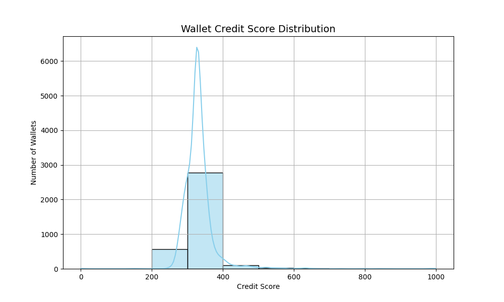

# 🏦 Aave V2 Credit Scoring System

A rule-based machine learning model that assigns credit scores (ranging from 0 to 1000) to DeFi wallets based on their historical transaction behavior on the Aave V2 protocol.

---

## 🎯 Objective

This project analyzes transaction-level data from the Aave V2 protocol and scores each wallet based on behavioral features such as loan repayment, liquidation history, and overall usage patterns. The scoring system helps identify responsible, risky, or bot-like wallets.

---

## 📊 Dataset

- **Source**: Aave V2 DeFi protocol
- **Format**: JSON (~100K transactions)
- **Size**: ~87 MB
- **Transaction Types**:
  - `deposit`
  - `borrow`
  - `repay`
  - `redeemunderlying`
  - `liquidationcall`

---

## 🚀 How to Run

### ✅ Prerequisites

Make sure you have Python 3.8+ and the following libraries installed:

```bash
pip install -r requirements.txt
```

### ▶️ Run the Script

```bash
python aave_credit_scoring.py
```

This will:
- Load and process the transaction data
- Generate behavior-based features
- Score each wallet on a 0–1000 scale
- Save outputs:
  - `wallet_scores.csv` – wallet address + credit score
  - `wallet_score_distribution.png` – visual score distribution

---

## 🧠 Scoring Logic

Wallets are scored using a **weighted combination** of features:

### 🔼 Positive Indicators
- High repay-to-borrow ratio
- Frequent deposits and repayments
- No or few liquidation events
- Recent and consistent activity

### 🔽 Negative Indicators
- Borrowing without repayment
- High liquidation frequency
- Infrequent or one-off activity

### 🧮 Feature Weights

| Feature                  | Weight |
|--------------------------|--------|
| Total transactions       | +1     |
| Deposit count            | +1     |
| Borrow count             | -0.5   |
| Repay count              | +1     |
| Redeem count             | +0.5   |
| Liquidation count        | -1     |
| Total deposited          | +1     |
| Total borrowed           | -0.5   |
| Total repaid             | +1     |
| Repay/Borrow ratio       | +1     |
| Last activity timestamp  | +0.2   |

All scores are normalized and scaled between **0 and 1000**.

---

## 📂 Project Structure

```
aave-credit-scoring/
├── aave_credit_scoring.py            # Main Python script
├── wallet_scores.csv                 # Wallet credit scores
├── wallet_score_distribution.png     # Credit score histogram
├── README.md                         # This file
├── analysis.md                       # Score range analysis & insights
├── requirements.txt                  # Project dependencies
```

---

## 📈 Credit Score Distribution

Below is a visualization of the credit score distribution across all wallets:



---

## 📊 Score Ranges

| Score Range | Interpretation |
|-------------|----------------|
| 800–1000    | Excellent – Highly responsible user |
| 600–799     | Good – Mostly reliable |
| 400–599     | Fair – Medium risk |
| 200–399     | Poor – Risky patterns |
| 0–199       | Very Poor – Likely exploitative/bot |

---

## 📄 Deliverables

- ✅ `wallet_scores.csv` – Wallet scores  
- ✅ `wallet_score_distribution.png` – Score histogram  
- ✅ `README.md` – Project overview  
- ✅ `analysis.md` – Score behavior insights  

---

## 🌐 Why This Matters

In DeFi, credit scoring enables **undercollateralized lending**—a breakthrough compared to today’s overcollateralized systems. This project lays the foundation for risk-based lending using real behavioral data from the Aave protocol.

---

## 👨‍💻 Author

**Jayesh Kamble** – AI Engineer Intern Candidate  
[LinkedIn](https://www.linkedin.com/in/jayesh-kamble-/)

---

## 📜 License

This project is licensed under the **MIT License**.
