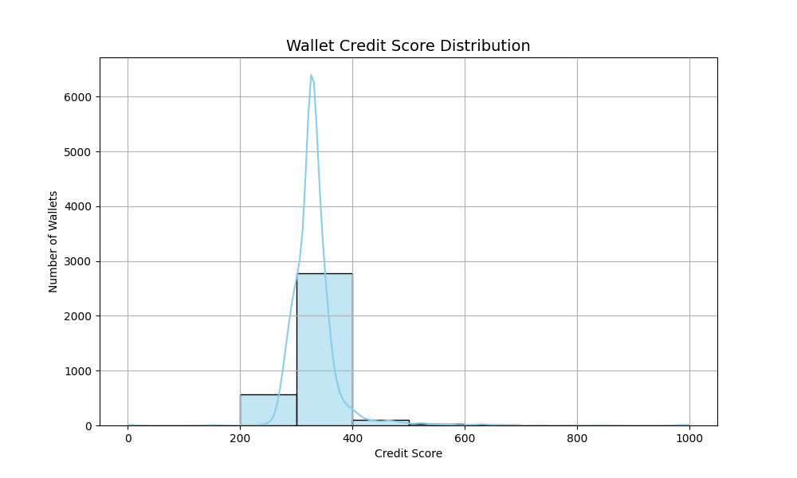

# 📊 Wallet Credit Score Analysis

## 🔍 Score Distribution

The credit scores range from 0 to 1000, representing wallet behavior across Aave V2:

| Score Range | Behavior Summary |
|-------------|------------------|
| 800–1000    | Excellent: Consistent deposits & repayments, no liquidations |
| 600–799     | Good: Mostly healthy behavior, few risks |
| 400–599     | Fair: Some repayment issues or limited activity |
| 200–399     | Poor: High borrow, low repay, possible liquidations |
| 0–199       | Very Poor: High risk, bot-like, or liquidated behavior |

## 📈 Observations Based on Plot

- Majority of wallets have scores between **300–400**
- Very few high scoring wallets (800+), suggesting most users are not highly responsible
- Some wallets scored very low due to **frequent liquidations or no repayments**
- High peak in 300s means many wallets had **average or limited activity**

## 📉 Graph

